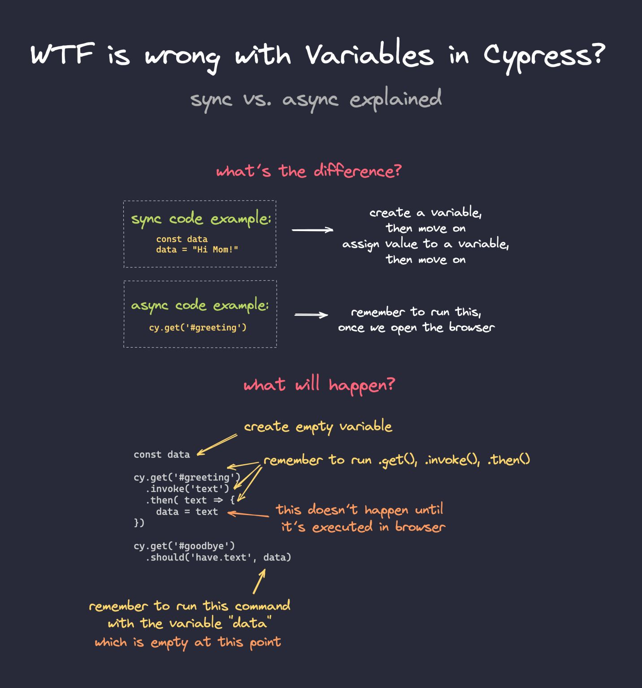

## Using variables in Cypress

Everything happening in Cypress can be summed up by this image:

Code like `console.log()` will run immediately. While this code is running, nothing else is happening - so the code is sync (blocking). Cypress commands will queue up and execute after browser opens.

## Structuring tests
- using `.then()` - easiest, but can create pyramid of doom quickly
- using aliases - reference by `.get()` or by `this.alias`
- to avoid `.then()` functions completely, add your request to `beforeEach()` - you can have multiple `beforeEach()` functions and stack them up 

## Useful reading
- [my blog on how variables work in Cypress](https://filiphric.com/cypress-basics-variables)
- [docs explaining variables and asynchronicity in Cypress](https://docs.cypress.io/guides/core-concepts/variables-and-aliases.html#Sharing-Context)
- [article on destructuring and how to use it](https://filiphric.com/using-destructuring-in-cypress)
- [article on the topic of "Arrange, Act, Assert" pattern](https://automationpanda.com/2020/07/07/arrange-act-assert-a-pattern-for-writing-good-tests/)